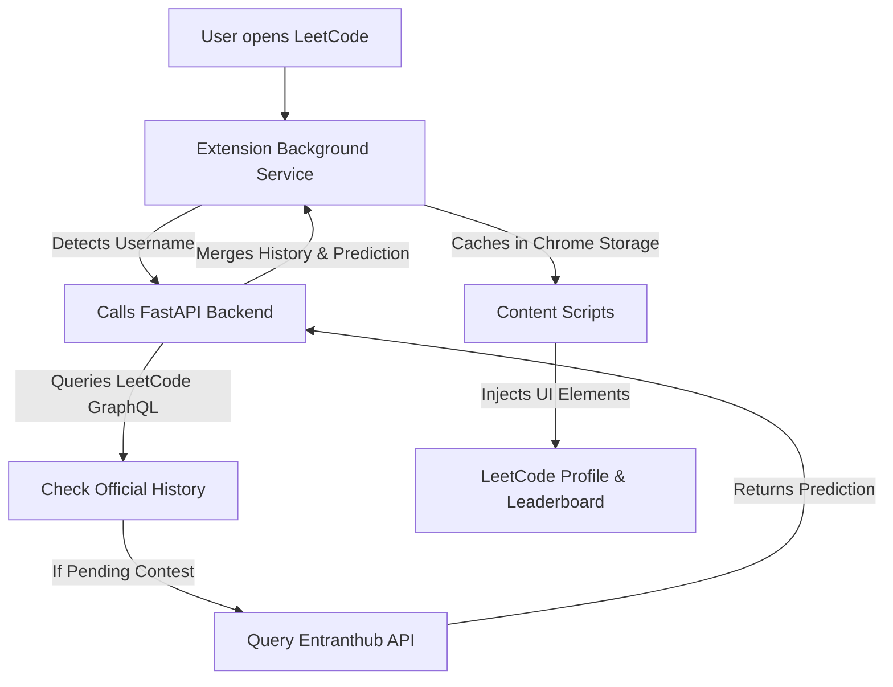

<p align="center">
  
</p>

# <div align="center">ForeCode</div>

<p align="center">
  Predict LeetCode Contest Ratings Before They're Official
</p>

<p align="center">
  
  
  
  
  
  
</p>

---

## What is ForeCode?

**ForeCode** is a lightweight, modern Chrome Extension and backend service designed for competitive programmers on LeetCode. 

After completing a LeetCode contest, waiting for official rating updates can take days. ForeCode solves this by seamlessly integrating highly accurate rating predictions directly into the LeetCode UI—showing you your predicted rating delta immediately after the contest concludes.

### Who is it for?
Competitive programmers, interview candidates, and coding enthusiasts who actively participate in LeetCode Weekly and Biweekly contests and want instant feedback on their performance.

---

## ✨ Features

- **✅ Predict Pending Contest Ratings:** Get instant rating delta predictions before LeetCode officially updates them.
- **✅ Profile Integration:** Injects your predicted rating directly into your LeetCode profile page.
- **✅ Leaderboard Badges:** Displays predicted rating deltas next to usernames on the contest leaderboard.
- **✅ Contest History:** View a beautifully rendered history of your past contests and rating changes inside the extension popup.
- **✅ High-Performance Backend:** Powered by a stateless FastAPI proxy for blazing-fast responses and minimal latency.
- **✅ Privacy-First:** No passwords stored, no tracking, and minimal Chrome permissions required.


## ⚙️ How It Works

ForeCode operates through a seamless pipeline connecting the Chrome Extension to our FastAPI backend and prediction providers.



---

## 💻 Tech Stack

| Component | Technology | Description |
| :--- | :--- | :--- |
| **Frontend** | Vanilla JS, HTML, CSS | Chrome Extension (Manifest V3) |
| **Backend** | Python, FastAPI | Stateless API Proxy |
| **Server/Runner** | Uvicorn | ASGI Web Server |
| **HTTP Client** | HTTPX | Async HTTP requests to external APIs |
| **Bundler** | esbuild, Node.js | Compiles and packages the extension |
| **Deployment** | Railway | Hosts the backend service |
| **Data Sources**| LeetCode GraphQL, Entranthub | User stats and contest predictions |

---

## 📂 Project Structure

```text
LC-Rating-Predictor/
├── backend/                  # FastAPI Proxy Service
│   ├── api/                  # API Route Handlers
│   ├── clients/              # External API Clients (LeetCode, Entranthub)
│   ├── schemas/              # Pydantic Data Models
│   ├── services/             # Business Logic (History, Predictions)
│   ├── utils/                # Helper Functions (Async HTTP)
│   ├── config.py             # Backend Configuration
│   ├── main.py               # FastAPI App Entry Point
│   ├── requirements.txt      # Python Dependencies
│   └── Procfile              # Railway Deployment Config
│
├── src/                      # Chrome Extension Source
│   ├── popup/                # Extension Popup UI (HTML/JS/CSS)
│   ├── scripts/              # Extension Logic
│   │   ├── background.js     # Service Worker (State & API calls)
│   │   ├── content.js        # Leaderboard UI Injector
│   │   ├── profileInjector.js# Profile UI Injector
│   │   └── lib/              # Shared JS Utilities
│
├── icons/                    # Extension Icons
├── manifest.json             # Chrome Extension Manifest V3
├── package.json              # Build Scripts & Dependencies
└── build.cjs                 # Custom Build Script (esbuild + archiver)
```

---

## 🚀 Installation & Setup

### 1. Clone the Repository
```bash
git clone https://github.com/Saaarthak0102/LC-Rating-Predictor.git
cd LC-Rating-Predictor
```

### 2. Backend Setup
The backend requires Python 3.8+.
```bash
cd backend
python -m venv venv
source venv/bin/activate  # On Windows: venv\Scripts\activate
pip install -r requirements.txt
uvicorn main:app --reload
```
*The API will be available at `http://localhost:8000`.*

### 3. Extension Setup
```bash
# Return to project root
cd ..
npm install
npm run build
```
This generates a production-ready `.zip` and populates the `dist/` directory.

**To load into Chrome:**
1. Open Chrome and navigate to `chrome://extensions/`
2. Enable **Developer mode** (top right corner).
3. Click **Load unpacked** and select the `dist/` folder.

---

## 🛠️ Configuration

### Environment Variables (Backend)
- `ALLOWED_ORIGINS`: Comma-separated list of allowed CORS origins. (Default: `http://localhost:3000,chrome-extension://*,http://127.0.0.1:8000`)

### Extension Configuration
If you deploy the backend to production (e.g., Railway), update the `API_URL` constant in `src/scripts/background.js` before building the extension:
```javascript
const API_URL = "https://your-production-url.railway.app/api/v1";
```

---

## 📡 API Documentation

### `GET /health`
Health check endpoint to verify the backend is running.
- **Response:** `{"status": "ok"}`

### `POST /api/v1/user/{username}/history`
Fetches a user's recent contest history, merging in any pending predictions.
- **Body:**
  ```json
  {
    "latest_attended_contest": {
      "titleSlug": "weekly-contest-400",
      "title": "Weekly Contest 400",
      "ranking": 150,
      "solved": 4
    }
  }
  ```
- **Response:** Array of contest history objects including `actual_rating`, `actual_delta`, and `status` (`confirmed`, `pending`, `prediction_pending`).

### `POST /api/v1/user/{username}/predict`
Fetches the raw prediction data for a specific contest.
- **Body:**
  ```json
  {
    "contest_slug": "weekly-contest-400",
    "contest_title": "Weekly Contest 400"
  }
  ```
- **Response (200 OK):** Prediction data including `predicted_rating` and `predicted_delta`.
- **Response (202 Accepted):** Returned if the prediction is not yet available from the provider.

---

## 🔒 Security & Privacy

ForeCode is built with privacy in mind:
- **No Passwords Stored:** All communication with LeetCode uses your active browser session securely.
- **Minimal Permissions:** Only requests access to `leetcode.com`, `leetcode.cn`, and the backend API.
- **No Tracking:** We do not collect analytics, telemetry, or behavioral data.
- **Stateless Backend:** The FastAPI server acts purely as a proxy and does not store your contest data in any database.

---

## 🤝 Contributing

We welcome contributions! Please follow these steps:
1. Fork the repository.
2. Create a new branch: `git checkout -b feature/your-feature-name`
3. Make your changes and commit: `git commit -m 'Add some feature'`
4. Push to the branch: `git push origin feature/your-feature-name`
5. Submit a pull request.

---
